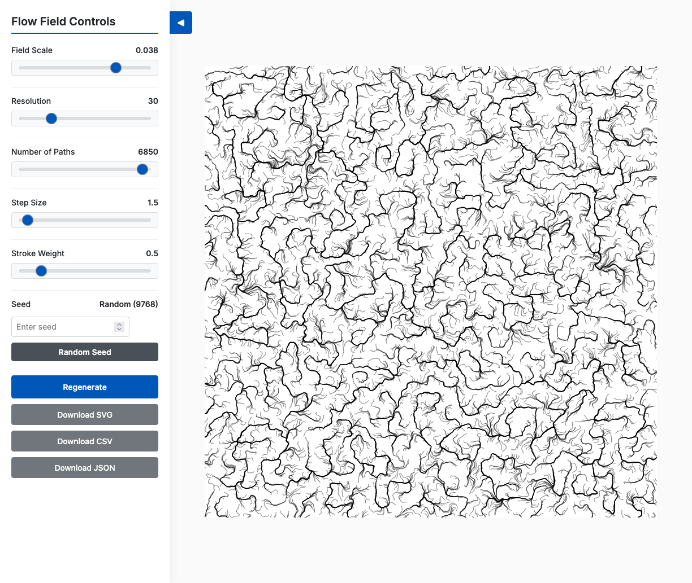
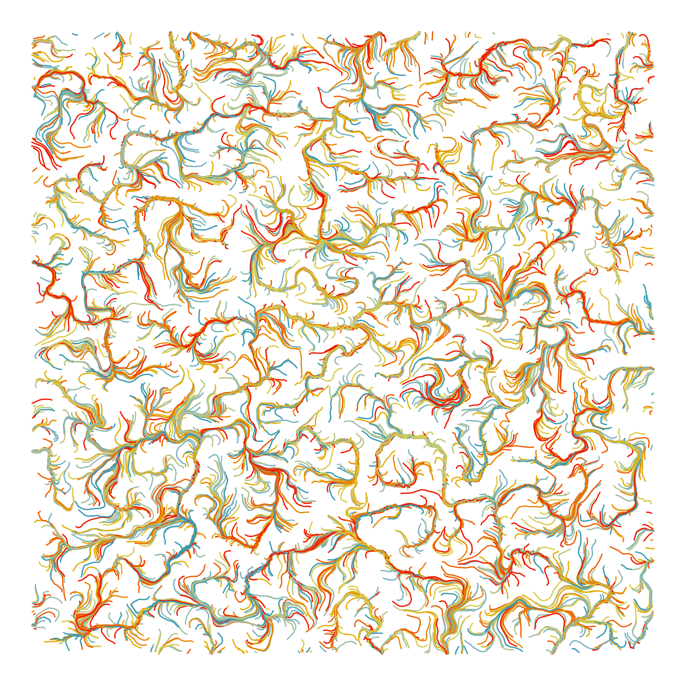
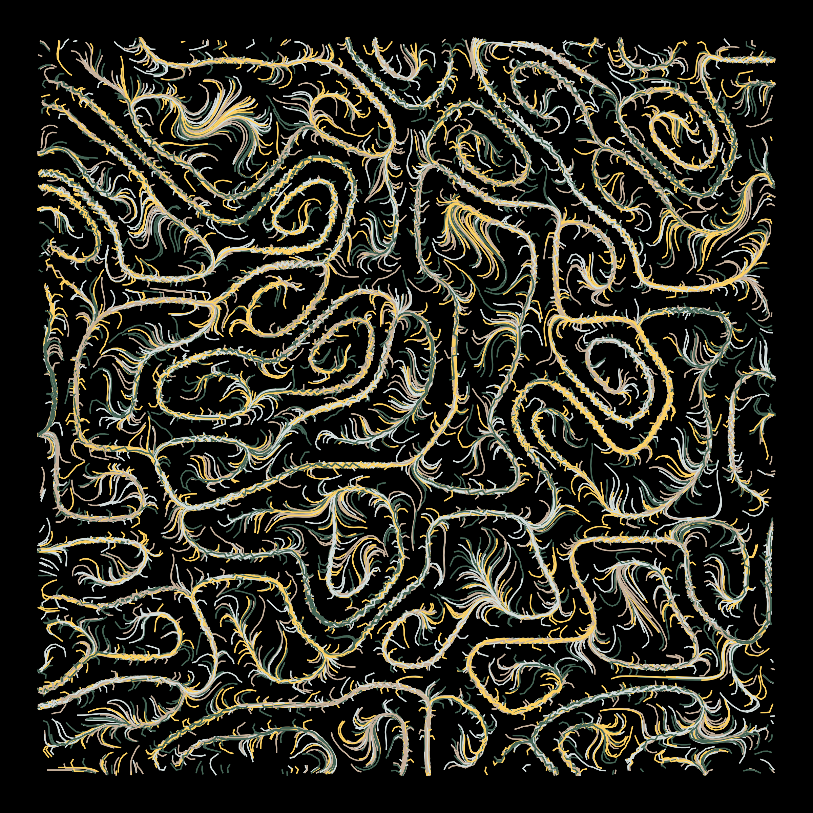
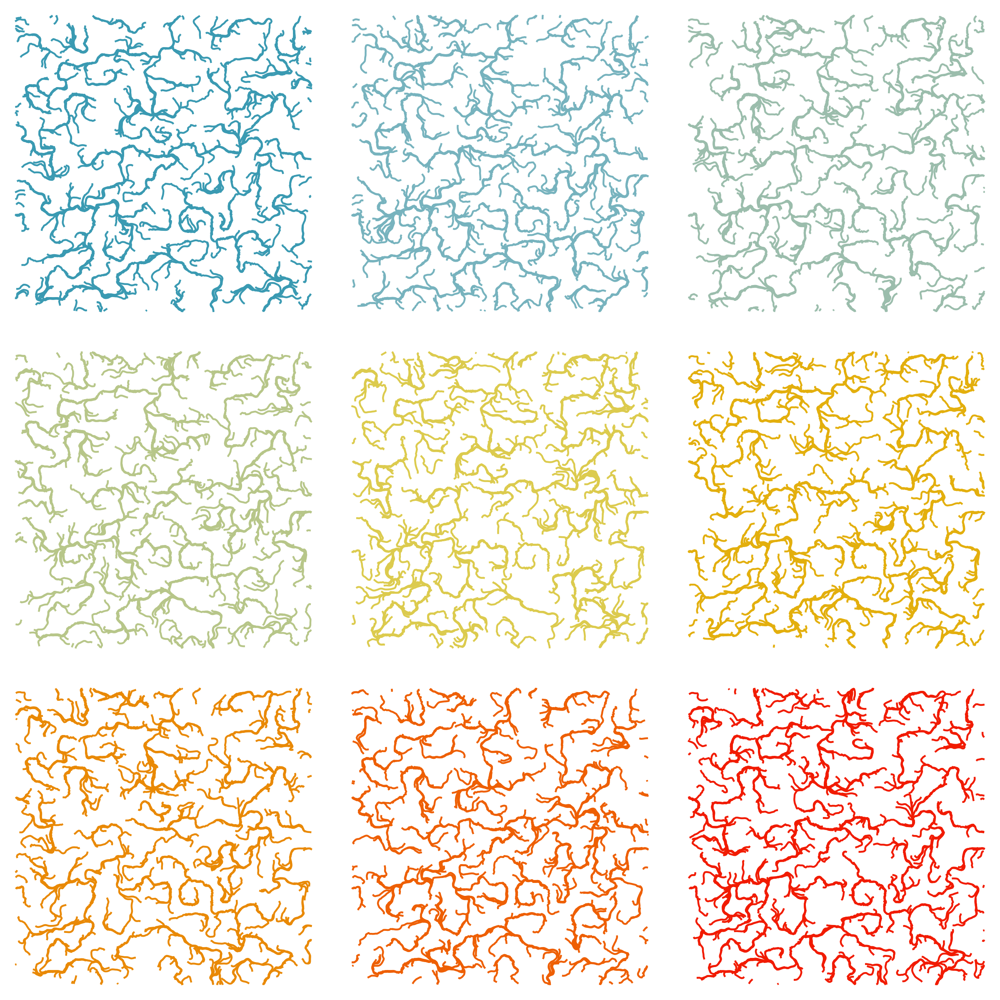
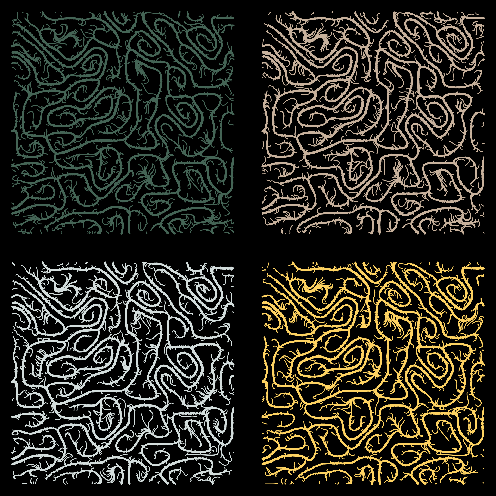

# Flow Field Art Creator

A pen plotter-ready generative art piece that creates organic, flowing lines using Perlin noise-based vector fields.


<p align="center">
  
</p>

## Overview

This project uses flowing patterns to guide virtual particles across your canvas, creating curves and paths. You can save your creation as an SVG file for pen plotters and laser cutters, or grab it as a JSON/CSV file to plot this anywhere.

Created with processing 4 and p5.js

## Motivation

At its core, Flow Field Art Creator is an exploration on a system governed by deterministic rules generate the appearance of chaos? The inherent randomness of the noise function produces patterns that resemble turbulent flows, swirling eddies, and organic forms—things we typically associate with chaotic systems.


## How It Works

### What is a Flow Field?

Flow field analogy would be thousands of tiny arrows showing which way the wind is blowing.

### The Mathematics

#### 1. Perlin Noise Generation

Perlin noise is used to make everything flow naturally. It's like the difference between static on a TV (random noise) and the way clouds form in the sky (Perlin noise) - one is jarring, the other is smooth and natural.

```javascript
let angle = noise(xoff, yoff) * TWO_PI * 4;
```

- `noise(xoff, yoff)` returns a value between 0 and 1
- We multiply by `TWO_PI * 4` (approximately 25.13) to get angles spanning multiple rotations
- This creates smooth directional changes across the field

#### 2. Vector Field Construction

The canvas is divided into a grid based on `STEP_SIZE`:

```javascript
columns = floor(width / STEP_SIZE);
rows = floor(height / STEP_SIZE);
```

For each grid cell, we:
1. Sample Perlin noise at coordinates `(xoff, yoff)`
2. Convert the noise value to an angle
3. Create a unit vector pointing in that direction using `p5.Vector.fromAngle(angle)`
4. Store the vector in a 1D array using the index formula: `index = x + y * columns`

The `FIELD_SCALE` parameter controls the "zoom level" of the noise:
- Smaller values (e.g., 0.001) = smoother, more gradual changes
- Larger values (e.g., 0.02) = more chaotic, turbulent patterns

#### 3. Particle Simulation

Each "path" represents a particle moving through the flow field:

```javascript
for (let j = 0; j < RESOLUTION; j++) {
  // 1. Find which grid cell we're in
  let x_index = floor(current_pos.x / STEP_SIZE);
  let y_index = floor(current_pos.y / STEP_SIZE);
  
  // 2. Look up the flow direction at this cell
  let index = x_index + y_index * columns;
  let force = field[index];
  
  // 3. Move in that direction
  current_pos.add(force.copy().setMag(STEP_SIZE));
}
```

**Step-by-step breakdown:**

1. **Position to Grid Mapping**: Convert continuous canvas coordinates to discrete grid indices using integer division (`floor`)

2. **Vector Lookup**: Retrieve the pre-calculated flow direction from the 1D array using the 2D-to-1D index conversion

3. **Movement**: Add the flow vector (scaled to `STEP_SIZE`) to the current position, creating the next point in the path

4. **Boundary Checking**: Stop drawing if the particle leaves the canvas bounds

### Key Parameters

| Parameter | Effect | Range |
|-----------|--------|-------|
| **Field Scale** | Controls the "wavelength" of the noise. Smaller = smoother flows | 0.001 - 0.02 |
| **Resolution** | Number of steps each particle takes (path length) | 10 - 100 |
| **Number of Paths** | Total particles/lines drawn | 100 - 2000 |
| **Step Size** | Distance traveled per step AND grid cell size | 1 - 10 |
| **Stroke Weight** | Line thickness in the output | 0.1 - 3.0 |
| **Seed** | Initializes the Perlin noise generator for reproducible results | Any integer |

### Algorithm Flow

```
1. Initialize
   ├─ Create canvas
   ├─ Calculate grid dimensions
   └─ Generate vector field using Perlin noise

2. For each path (particle):
   ├─ Start at random position
   ├─ For each step:
   │  ├─ Find current grid cell
   │  ├─ Look up flow direction
   │  ├─ Move particle in that direction
   │  ├─ Record position
   │  └─ Check boundaries
   └─ Draw polyline connecting all positions

3. Export
   └─ Convert all paths to SVG polylines
```

### SVG Export

The SVG generation creates a proper vector graphics file:

```xml
<svg xmlns="http://www.w3.org/2000/svg" width="800" height="800">
  <polyline points="x1,y1 x2,y2 x3,y3..." />
  ...
</svg>
```

Each path becomes a `<polyline>` element containing all the points the particle visited. This format is ideal for:
- Pen plotters (AxiDraw, HP 7475A, etc.)
- Laser cutters
- CNC machines
- Vector editing in Illustrator/Inkscape

### Performance Considerations

1. **Pre-computation**: The entire vector field is calculated once during setup, not per-frame
2. **Array Storage**: Using a 1D array with index conversion is more memory-efficient than a 2D array
3. **Vector Copying**: `force.copy()` prevents modifying the original field vectors
4. **Bounds Checking**: Early exit when particles leave the canvas saves computation

## Mathematical Concepts Used

- **Perlin Noise**: Coherent gradient noise for natural randomness
- **Vector Mathematics**: Direction, magnitude, and addition
- **Coordinate Transforms**: 2D continuous → 2D discrete → 1D array indexing
- **Parametric Curves**: Paths defined by sequential point positions
- **Trigonometry**: Angle-to-vector conversion using `cos(θ)` and `sin(θ)` (hidden in `fromAngle()`)

## Usage

1. Open `index.html` in a web browser
2. Adjust parameters using the sliders
3. Click "Regenerate" to create a new design
4. Click "Download SVG" to export for plotting
5. Click CSV/JSON to download all the cordinates and parameters of the plot

## Dependencies

- [p5.js](https://p5js.org/) - Creative coding library providing canvas rendering and Perlin noise implementation

## File Structure

```
├── index.html      # HTML interface with controls
├── flowfields.js   # Core flow field generation logic
└── README.md       # This file
```

## Tips for Best Results

- **For organic, flowing patterns**: Use low field scale (0.002-0.005) and high resolution (50-100)
- **For chaotic, energetic patterns**: Use high field scale (0.01-0.02) and low step size (2-3)
- **For plotter efficiency**: Lower the number of paths to reduce plotting time
- **For fine details**: Increase resolution but decrease stroke weight

## Visualizing with R

Want to take your flow field art to the next level? The exported CSV files work beautifully with R! 

```R
library(tidyverse)
library(wesanderson) 

# Load your flow field data
plotter <- read_csv("plotter_flow_field.csv")
pal <- wes_palette(9, name = "Zissou1", type = "continuous")

# Create a basic flow field visualization
plotter %>% ggplot(aes(x, y, group = path_id)) +
  geom_path() + theme_void()

plotter %>% 
  group_by(path_id) %>% 
  mutate(color = sample(pal, 1)) %>% 
  ungroup() %>% 
  ggplot(aes(x, y, group = path_id)) +
  geom_path(aes(color = color), show.legend = F) +
  theme_void() +
  scale_color_identity()
```


<p align="center">
  
</p>

<p align="center">
  
</p>
<p align="center">
  
</p>
<p align="center">
  
</p>

*The R script uses the Wes Anderson color palette package. You can find the complete R script and more examples in the `example` folder.*

## License

MIT