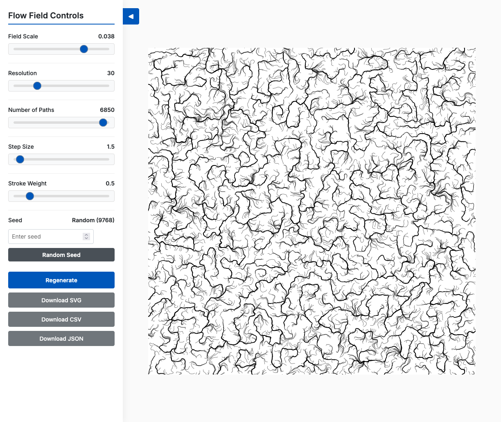

# Flow Field Art Creator

Generative flow field lab for pen plotter–ready art featuring multiple vector field algorithms, multi-source radial & spiral flows, dynamic method parameters, and optional path repulsion to reduce line crossings. Added functionality to export the results as cordinates in a csv for your own further experimentation.



## Highlights

* 9 field methods with tunable parameters, including Reaction-Diffusion and LIC
* Multi-core path tracing using Web Workers (hybrid parallelization)
* Multi-source radial & spiral patterns (random / grid / circle / ring layouts)
* Magnetic-style path repulsion (inverse-square) with post-processing pass
* Auto-regenerate mode + R keyboard shortcut + deterministic seed display
* Progress overlay with cancel button keeps the UI responsive
* Export to SVG / CSV / JSON with full metadata

## Field Methods & Parameters

| Method | Purpose | Key Parameters |
|--------|---------|----------------|
| Quantized Perlin | Perlin angle snapped to equal divisions | Divisions, Angle Noise Mult, Jitter |
| Smooth Perlin | Classic smooth Perlin directional field | Angle Scale, Rotation Offset |
| Pseudo Curl | Curl-like rotational flow from noise derivatives | Derivative ε, Vector Strength |
| Radial (Inward) | Attraction/repulsion toward multiple centers | Inward vs Outward, Falloff, Sources Count, Distribution, Blend Mode |
| Spiral | Multi-arm spiral blends around sources | Inwardness, Twist, Spiral Arms, Arm Sharpness, Sources Count, Distribution, Rotation Dir |
| Sine Waves | Angular interference from sine/cosine waves | Frequency X, Frequency Y, Direction Mode, Amplitude |
| Reaction-Diffusion | Gray-Scott simulation gradients steer flow | Feed Rate, Kill Rate, Diffusion A/B, Iterations, Gradient Mode, Pattern Seed |
| Line Integral Convolution | Texture-driven flow built from LIC over a base field | Base Field, Streamline Length, Kernel, Texture Resolution, Contrast Boost, Flow Direction |
| (Future-ready) Extensions | Add your own by extending `field-methods.js` | Custom params |

### Multi-Source Controls

For Radial / Spiral:

* Sources Count: number of centers
* Distribution: random, grid, circle/ring
* Randomize Sources: regenerate positions instantly
* Blend Mode (Radial): closest, average, weighted
* Rotation Dir (Spiral): auto (alternating), cw, ccw

### Path Interaction (Repulsion)

Toggle Enable Repulsion to apply inverse-square separation between nearby path points.

Parameters:

* Repel Radius: search radius for neighbor points
* Repel Strength: base coefficient k in F = k / r^2
* Max Neighbors: performance cap
* Angle Dampen: blend factor between original flow direction and repulsion-influenced direction

Repulsion is disabled by default; spatial hashing only activates when enabled.

### Reaction-Diffusion Notes

* Simulations are expensive: anything above ~2000 iterations will log a warning and can take multiple seconds on large canvases.
* `Gradient Mode` changes how the flow vectors are derived — try `difference` for maze-like negative space and `laplacian` for edge-following paths.
* `Pattern Seed` controls how many initial B-chemical patches spawn; lower values yield isolated blobs, higher values form labyrinths.
* Results are cached by seed and parameters; tweak sliders gradually to reuse the cache, or hit **Random Seed** to spin up a fresh simulation.

### LIC Notes

* `Base Field` reuses any existing method; its own parameters (e.g., Spiral arms) are respected, so adjust those first if you want a different underlying flow.
* `Streamline Length` and `Kernel` control streak sharpness — longer streaks blur more but emphasize directionality.
* For fast iteration, temporarily lower `Texture Resolution` (0.6–0.8) and `Streamline Length`; restore higher values for final renders.
* `Flow Direction` lets you switch between following the base field, moving perpendicular, or following the texture gradients for painterly crosshatching.

## Core Global Parameters

| Parameter | Effect |
|-----------|--------|
| Field Scale | Noise sampling increment (smaller = smoother) |
| Resolution | Steps per path (path length) |
| Number of Paths | How many particle traces to draw |
| Step Size | Grid spacing and movement magnitude |
| Stroke Weight | Line thickness |
| Seed | Deterministic noise seeding (blank = random; Random Seed button shows the active value) |
| Field Method | Select algorithm from dropdown |
| Auto Regenerate | Recompute after every change |

## Shortcuts & UI Actions

| Action | Description |
|--------|-------------|
| R key | Force regenerate current field |
| Random Seed button | Generates and displays a new deterministic noise seed |
| Randomize Sources button | Resamples source positions for radial/spiral |
| Enable Repulsion checkbox | Toggles path separation |
| Auto Regenerate checkbox | Live update while adjusting sliders |

## Data Export

| Format | Contents |
|--------|----------|
| SVG | Polylines for each path (plotter-ready) |
| CSV | path_id, point_index, x, y for all points |
| JSON | Metadata only (timestamp, canvas, seed, parameters — no path coordinates) |

JSON output now omits all point data; it only includes metadata and parameters (interaction values are still included when repulsion is active).

## Internal Algorithm Notes

1. Field Generation: Pre-compute p5.Vector directions for each grid cell based on selected method.
2. Path Construction: For each path, iteratively sample field → move → record point. Stops on boundary.
3. Repulsion (optional): Spatial bucket hash (size ≈ Repel Radius) collects prior points. For each step, neighbor vectors aggregated with inverse-square attenuation, blended into step direction.
4. Multi-Source Methods: Source list generated on method change or parameter update; each cell’s vector mixes contributions.
5. Reaction-Diffusion: Gray-Scott grids are simulated once per parameter+seed combination and cached for reuse while the setup is unchanged.
6. LIC: Base field vectors and LIC textures are cached per parameter set to avoid recomputing heavy convolutions on every cell.

## Performance Tips

| Scenario | Tip |
|----------|-----|
| High path count | Lower Resolution or disable Repulsion |
| Dense repulsion | Reduce Repel Radius / Max Neighbors |
| Detailed spirals | Moderate arms (3–6) & adjust Twist slowly |
| Smooth gradients | Lower Field Scale (0.002–0.006) |
| Reaction-Diffusion taking seconds | Lower Simulation Steps or Pattern Seed; consider smaller canvas |
| LIC preview sluggish | Reduce Streamline Length or Texture Resolution while tuning |

## Hybrid Parallelization & Workers

The generator splits path tracing across multiple CPU cores via Web Workers. Keep in mind:

* Workers require the app to be served over HTTP/HTTPS; opening `index.html` with `file://` will fall back to single-threaded mode.
* `path-worker.js` receives transferable `Float32Array` field data—avoid modifying it to use p5.js helpers.
* Repulsion now runs as a sequential post-processing pass on the main thread, so the UI remains responsive while workers stream back path batches.
* The progress overlay reflects total paths completed; the **Cancel** button safely terminates all workers and resets the overlay.

## Extending FIELD_METHODS

Add a new method object:

```javascript
FIELD_METHODS.myMethod = {
  name: 'My Method',
  description: 'Custom behavior',
  params: {
    myParam: {label:'My Param', type:'range', min:0, max:1, step:0.01, default:0.5}
  },
  generate: ({i,j,xoff,yoff}) => {
    // Return a p5.Vector direction
    return p5.Vector.fromAngle(noise(xoff,yoff)*TWO_PI);
  }
};
```

The UI auto-populates controls and stores values in `METHOD_PARAMS.myMethod.myParam`.

## Usage

1. From the project root, start a lightweight web server so Web Workers can load, e.g. `python3 -m http.server 8000`.
2. Open `http://localhost:8000/index.html` in your browser (Chrome, Edge, or Safari).
3. Pick a Field Method and adjust its parameters on the right panel.
4. (Optional) Enable Auto Regenerate for live tweaking; otherwise press **Regenerate** or hit **R**. The overlay progress bar shows worker activity and lets you cancel mid-run.
5. Use **Random Seed** to lock a new deterministic seed or clear the field for automatic reseeding between runs.
6. Export via SVG / CSV / JSON buttons once satisfied.

## Regression Checks

Run the web/runtime regression harness locally:

```bash
node scripts/regression-check.cjs
```

It validates:

* Field method registry availability
* Export serializer stability (CSV / JSON / SVG)
* Seed reproducibility in path tracing
* Worker/serial tracing parity (including shared-buffer worker path when available)

## File Structure

```text
├── index.html        # UI layout & script includes
├── field-methods.js  # Registry of field definitions + parameter metadata
├── flowfields.js     # Core controller, caching, workers, repulsion, exports
├── path-worker.js    # Web Worker that traces path batches off the main thread
├── img/gui.png       # Interface screenshot
├── cli/              # Node.js CLI generator (build outputs, methods, noise)
└── README.md         # Documentation
```


## License

MIT

## Acknowledgments

Built with p5.js. Inspired by classic flow field, curl noise, and generative plotting techniques.
