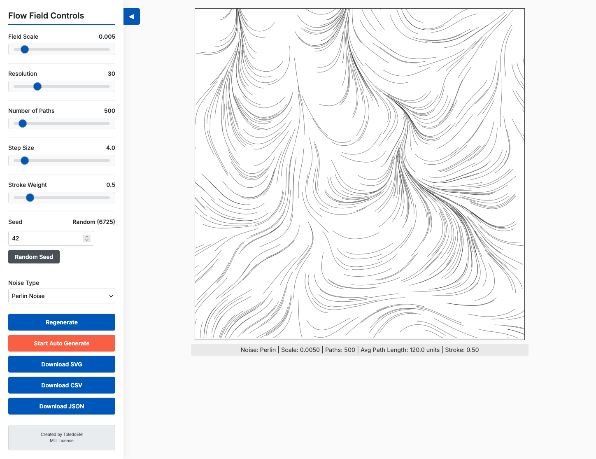

# Flow Field Art Creator

A sophisticated pen plotter-ready generative art tool that creates organic, flowing lines using advanced noise-based vector fields with multi-layer blending, variable stroke properties, and intelligent negative space avoidance.

<p align="center">
  
</p>

## Overview

This project uses flowing patterns to guide virtual particles across your canvas, creating curves and paths with control and sophistication. The system now features multi-layer field blending, variable stroke weights and transparency, per-path color drift, negative space repulsion, and advanced export optimizations. You can save your creation as an optimized SVG file for pen plotters and laser cutters, or grab it as JSON/CSV files for analysis and plotting anywhere.

Created with p5.js and modern ES modules for enhanced modularity and performance.

## Motivation

At its core, Flow Field Art Creator is an exploration on a system governed by deterministic rules generate the appearance of chaos? The inherent randomness of the noise function produces patterns that resemble turbulent flows, swirling eddies, and organic forms—things we typically associate with chaotic systems.


## How It Works

### What is a Flow Field?

Flow field analogy would be thousands of tiny arrows showing which way the wind is blowing.

### The Mathematics

#### 1. Perlin Noise Generation

Perlin noise is used to make everything flow naturally. It's like the difference between static on a TV (random noise) and the way clouds form in the sky (Perlin noise) - one is jarring, the other is smooth and natural.

```javascript
let angle = noise(xoff, yoff) * TWO_PI * 4;
```

- `noise(xoff, yoff)` returns a value between 0 and 1
- We multiply by `TWO_PI * 4` (approximately 25.13) to get angles spanning multiple rotations
- This creates smooth directional changes across the field

#### 2. Vector Field Construction

The canvas is divided into a grid based on `STEP_SIZE`:

```javascript
columns = floor(width / STEP_SIZE);
rows = floor(height / STEP_SIZE);
```

For each grid cell, we:
1. Sample Perlin noise at coordinates `(xoff, yoff)`
2. Convert the noise value to an angle
3. Create a unit vector pointing in that direction using `p5.Vector.fromAngle(angle)`
4. Store the vector in a 1D array using the index formula: `index = x + y * columns`

The `FIELD_SCALE` parameter controls the "zoom level" of the noise:
- Smaller values (e.g., 0.001) = smoother, more gradual changes
- Larger values (e.g., 0.02) = more chaotic, turbulent patterns

#### 3. Particle Simulation

Each "path" represents a particle moving through the flow field:

```javascript
for (let j = 0; j < RESOLUTION; j++) {
  // 1. Find which grid cell we're in
  let x_index = floor(current_pos.x / STEP_SIZE);
  let y_index = floor(current_pos.y / STEP_SIZE);
  
  // 2. Look up the flow direction at this cell
  let index = x_index + y_index * columns;
  let force = field[index];
  
  // 3. Move in that direction
  current_pos.add(force.copy().setMag(STEP_SIZE));
}
```

**Step-by-step breakdown:**

1. **Position to Grid Mapping**: Convert continuous canvas coordinates to discrete grid indices using integer division (`floor`)

2. **Vector Lookup**: Retrieve the pre-calculated flow direction from the 1D array using the 2D-to-1D index conversion

3. **Movement**: Add the flow vector (scaled to `STEP_SIZE`) to the current position, creating the next point in the path

4. **Boundary Checking**: Stop drawing if the particle leaves the canvas bounds

### Key Parameters

#### Core Flow Field Parameters

| Parameter | Effect | Range |
|-----------|--------|-------|
| **Field Scale** | Controls the "wavelength" of the noise. Smaller = smoother flows | 0.001 - 0.02 |
| **Resolution** | Number of steps each particle takes (path length) | 10 - 100 |
| **Number of Paths** | Total particles/lines drawn | 100 - 7000 |
| **Step Size** | Distance traveled per step AND grid cell size | 1 - 50 |
| **Stroke Weight** | Base line thickness in the output | 0.1 - 3.0 |
| **Seed** | Initializes the noise generator for reproducible results | Any integer |

#### Advanced Field Options (Phase 4)

| Parameter | Effect | Range |
|-----------|--------|-------|
| **Multi-Layer Blending** | Combines base field with secondary high-frequency field | On/Off |
| **Base Field Weight** | Influence strength of primary noise field | 0.1 - 1.0 |
| **Secondary Field Scale** | Frequency of secondary field (higher = more detail) | 0.005 - 0.05 |

#### Stroke Variations (Phase 4)

| Parameter | Effect | Options |
|-----------|--------|---------|
| **Variable Stroke Mode** | How stroke properties change along paths | None, Weight by Curvature, Weight Taper, Alpha by Curvature, Alpha Taper |
| **Stroke Weight Multiplier** | Intensity of weight variations | 1.0 - 5.0 |
| **Color Drift** | Subtle color shifts along path lifetime | On/Off |
| **Color Drift Amount** | Strength of color variation | 0.0 - 0.5 |

#### Negative Space Repulsion (Phase 4)

| Parameter | Effect | Range |
|-----------|--------|-------|
| **Repulsion Strength** | How strongly particles avoid negative space | 0.5 - 10.0 |
| **Repulsion Radius Multiplier** | How far repulsion field extends beyond circle | 1.0 - 3.0 |

#### Export Optimizations (Phase 5)

| Parameter | Effect | Range/Options |
|-----------|--------|---------------|
| **RDP Simplification** | Reduces point count while preserving shape | On/Off |
| **RDP Tolerance** | Aggressiveness of simplification | 0.1 - 2.0 |
| **Merge Collinear** | Removes unnecessary points on straight lines | On/Off |
| **Coordinate Precision** | Decimal places for coordinates | 1 - 4 |
| **Export Color Mode** | How colors are organized in SVG | Palette, Monochrome, Per-Layer |

## Advanced Features

### Multi-Layer Field Blending

The system can now blend two noise fields at different frequencies to create more complex, natural-looking flow patterns:

```javascript
// Primary field (smooth, large-scale flow)
const baseAngle = noise(x * baseFieldScale, y * baseFieldScale) * TWO_PI * 4;
const baseVector = p5.Vector.fromAngle(baseAngle);

// Secondary field (detailed, high-frequency turbulence)  
const secondaryAngle = noise(x * secondaryFieldScale, y * secondaryFieldScale) * TWO_PI * 4;
const secondaryVector = p5.Vector.fromAngle(secondaryAngle);

// Weighted combination
const combinedVector = baseVector.mult(baseWeight).add(secondaryVector.mult(secondaryWeight));
```

This creates flow fields that have both large-scale structure and fine-scale detail, similar to real fluid dynamics.

### Variable Stroke Properties

Each path segment can now have different visual properties:

- **Weight by Curvature**: Lines get thicker in areas of high directional change, emphasizing turbulent regions
- **Weight Taper**: Lines gradually thin from start to end, creating organic, natural endpoints  
- **Alpha by Curvature**: Transparency varies with path curvature for subtle depth effects
- **Alpha Taper**: Lines fade out gradually, eliminating harsh path endings

### Negative Space Repulsion

Particles now intelligently avoid user-defined circular areas through a sophisticated force field system:

```javascript
// Calculate repulsion force from negative space
const distance = sqrt((x - maskX)² + (y - maskY)²);
const repulsionRadius = maskRadius * radiusMultiplier;

if (distance < repulsionRadius) {
  const strength = (repulsionRadius - distance) / repulsionRadius;
  const force = (direction_away_from_center) * strength² * repulsionStrength;
  
  // Combine with flow field force
  particle.velocity = flowForce + repulsionForce;
}
```

This creates natural-looking deflection around obstacles, like water flowing around rocks.

### Export Optimizations

The SVG export system now includes several optimization options:

- **RDP Simplification**: Uses the Ramer-Douglas-Peucker algorithm to reduce file size while preserving visual quality
- **Collinear Merging**: Removes redundant points on straight line segments
- **Coordinate Rounding**: Reduces precision to eliminate floating-point artifacts
- **Color Modes**: 
  - Palette: Standard grouped colors
  - Monochrome: All black for pen plotting
  - Per-Layer: Separate SVG groups for each color

### Algorithm Flow

```
1. Initialize
   ├─ Create canvas
   ├─ Calculate grid dimensions
   └─ Generate vector field using Perlin noise

2. For each path (particle):
   ├─ Start at random position
   ├─ For each step:
   │  ├─ Find current grid cell
   │  ├─ Look up flow direction
   │  ├─ Move particle in that direction
   │  ├─ Record position
   │  └─ Check boundaries
   └─ Draw polyline connecting all positions

3. Export
   └─ Convert all paths to SVG polylines
```

### SVG Export

The SVG generation creates a proper vector graphics file:

```xml
<svg xmlns="http://www.w3.org/2000/svg" width="800" height="800">
  <polyline points="x1,y1 x2,y2 x3,y3..." />
  ...
</svg>
```

Each path becomes a `<polyline>` element containing all the points the particle visited. This format is ideal for:
- Pen plotters (AxiDraw, HP 7475A, etc.)
- Laser cutters
- CNC machines
- Vector editing in Illustrator/Inkscape

### Performance Considerations

1. **Pre-computation**: The entire vector field is calculated once during setup, not per-frame
2. **Array Storage**: Using a 1D array with index conversion is more memory-efficient than a 2D array
3. **Vector Copying**: `force.copy()` prevents modifying the original field vectors
4. **Bounds Checking**: Early exit when particles leave the canvas saves computation

## Mathematical Concepts Used

- **Perlin Noise**: Coherent gradient noise for natural randomness
- **Vector Mathematics**: Direction, magnitude, and addition
- **Coordinate Transforms**: 2D continuous → 2D discrete → 1D array indexing
- **Parametric Curves**: Paths defined by sequential point positions
- **Trigonometry**: Angle-to-vector conversion using `cos(θ)` and `sin(θ)` (hidden in `fromAngle()`)

## Usage

1. Open `index.html` in a web browser
2. Adjust parameters using the sliders
3. Click "Regenerate" to create a new design
4. Click "Download SVG" to export for plotting
5. Click CSV/JSON to download all the cordinates and parameters of the plot
6. (New) Choose a color palette from the Palette dropdown to colorize paths
7. (New) Use keyboard shortcuts (see below) for faster iteration

### Running Locally (Modules & CORS)

Because the app now uses ES modules (`src/index.js`), you MUST serve the files over HTTP (opening `index.html` directly with `file://` will fail with CORS errors).

Quick options:

```bash
# Node built-in dev server (added to repo)
npm install
npm run dev
# → http://localhost:5173

# OR Python 3 quick server
python3 -m http.server 5173

# OR npx
npx http-server -p 5173
```

Then open: `http://localhost:5173/` in your browser.

### Keyboard Shortcuts

| Key | Action |
|-----|--------|
| R | Regenerate artwork |
| A | Toggle auto-generate |
| S | Download SVG |
| C | Download CSV |
| J | Download JSON |
| H | Hide / show control panel |

### Palettes

Available palette names (cyclic across paths): `mono`, `warm`, `cool`, `earth`, `neon`, `pastel`.

### SVG Metadata

The exported SVG now embeds a `<metadata>` tag containing a JSON blob with generation parameters (seed, palette, noise type, etc.) for reproducibility. Example (URL-encoded inside the tag):

```xml
<metadata id="flow-field-metadata">%7B%22timestamp%22...%7D</metadata>
```

You can decode this to reconstruct the configuration.

## Dependencies

- [p5.js](https://p5js.org/) - Creative coding library providing canvas rendering and Perlin noise implementation

## File Structure

```
├── index.html                    # HTML interface with controls
├── package.json                  # Node.js dependencies and scripts
├── ROADMAP.md                   # Development phases and features
├── README.md                    # This documentation
├── flowfields.js                # Legacy compatibility (deprecated)
├── libraries/
│   ├── p5.min.js               # p5.js creative coding library
│   └── simplex-noise.js        # Simplex noise implementation
└── src/                        # Modern ES modules architecture
    ├── index.js                # Main orchestration and UI wiring
    ├── config/
    │   └── defaultConfig.js    # Configuration defaults and validation
    ├── field/
    │   └── NoiseField.js       # Flow field generation with multi-layer support
    ├── sim/
    │   └── ParticleSimulator.js # Particle physics with repulsion and stroke variations
    ├── render/
    │   └── CanvasRenderer.js   # Canvas drawing with advanced visual effects
    ├── export/
    │   ├── SVGExporter.js      # SVG generation with optimization options
    │   └── GeometryUtils.js    # RDP simplification and geometry utilities
    └── palette/
        └── palettes.js         # Color palette definitions
```

## Tips for Best Results

### Basic Flow Patterns
- **For organic, flowing patterns**: Use low field scale (0.002-0.005) and high resolution (50-100)
- **For chaotic, energetic patterns**: Use high field scale (0.01-0.02) and low step size (2-3)
- **For plotter efficiency**: Lower the number of paths to reduce plotting time
- **For fine details**: Increase resolution but decrease stroke weight

### Advanced Techniques
- **Multi-layer complexity**: Enable multi-layer blending with base weight 0.7, secondary scale 0.015-0.025
- **Natural stroke variation**: Use "Alpha Taper" or "Weight Taper" for organic line endings
- **Subtle color effects**: Enable color drift with amount 0.05-0.15 for gentle variation
- **Obstacle avoidance**: Add 2-3 negative space circles with repulsion strength 2.0-4.0

### Export Optimization
- **For plotting**: Enable RDP simplification (tolerance 0.3-0.7) and use monochrome export mode  
- **For cutting**: Use coordinate precision 2, enable collinear merging
- **For large files**: Use higher RDP tolerance (1.0+) to reduce point count significantly
- **For print**: Use per-layer export mode for easier color management in design software

### Creative Combinations
- **Turbulent atmosphere**: Multi-layer ON + curvature-based alpha + negative space for realistic fluid simulation
- **Organic growth**: Weight taper + color drift + low field scale for plant-like structures  
- **Technical drawings**: Monochrome + RDP simplification + uniform stroke for clean, precise plots
- **Artistic prints**: Per-layer export + alpha variations + multiple palettes for complex color compositions

## Visualizing with R

Want to take your flow field art to the next level? The exported CSV files work beautifully with R! 

```R
library(tidyverse)
library(wesanderson) 

# Load your flow field data
plotter <- read_csv("plotter_flow_field.csv")
pal <- wes_palette(9, name = "Zissou1", type = "continuous")

# Create a basic flow field visualization
plotter %>% ggplot(aes(x, y, group = path_id)) +
  geom_path() + theme_void()

plotter %>% 
  group_by(path_id) %>% 
  mutate(color = sample(pal, 1)) %>% 
  ungroup() %>% 
  ggplot(aes(x, y, group = path_id)) +
  geom_path(aes(color = color), show.legend = F) +
  theme_void() +
  scale_color_identity()
```


<p align="center">
  
</p>

<p align="center">
  
</p>
<p align="center">
  
</p>
<p align="center">
  
</p>

*The R script uses the Wes Anderson color palette package. You can find the complete R script and more examples in the `example` folder.*

## License

MIT